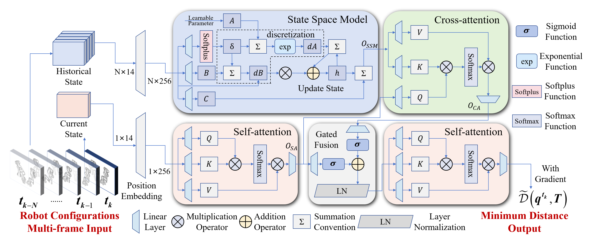

# Minimum Distance Prediction Network


> **Reactive Self-Collision Avoidance for Dual-Arm Robots Using a Temporal Feature Modeling and Fusion Network**\
> Xuejin Luo*, Runshi Zhang*, Siqin Yang*, Zhen Sun*, Ruizhi Zhang*, Junchen Wang*\
> Paper has been ACCEPTED for publication in the IEEE Transactions on Automation Science and Engineering.

## About

This repository contains a minimum distance prediction network for dual-arm manipulators to avoid self-collision. The network inputs are the joint angles of neighboring frames of the dual arms, and the outputs are the minimum distance and gradient. The latter can be computed in real time as a self-touch avoidance constraint in quadratic programming at an operating frequency of 50Hz.

`checkpoints`: folder that saves the trained model.
`data`: store the minimum distance data set of dual-arm manipulators.
`models`: contains the internal structure of each model.
`optimize`: testing model constraint calculations in quadratic programming.
`scripts`: scripts that contain training and testing models
`train`: training code manager.
`utils`: other functions.

## Requirements

- Ubuntu 22.04
- NVIDIA GPU
- PyTorch 2.0.0+
- CUDA 11.7+
- mamba_ssm

## Train

```bash
sh scripts\train\SSM_cross_attn_train.sh
```

## Eval

```bash
sh scripts\eval\SSM_cross_attn_eval.sh
```

## Citation
If you find this repository helpful, please consider citing:

